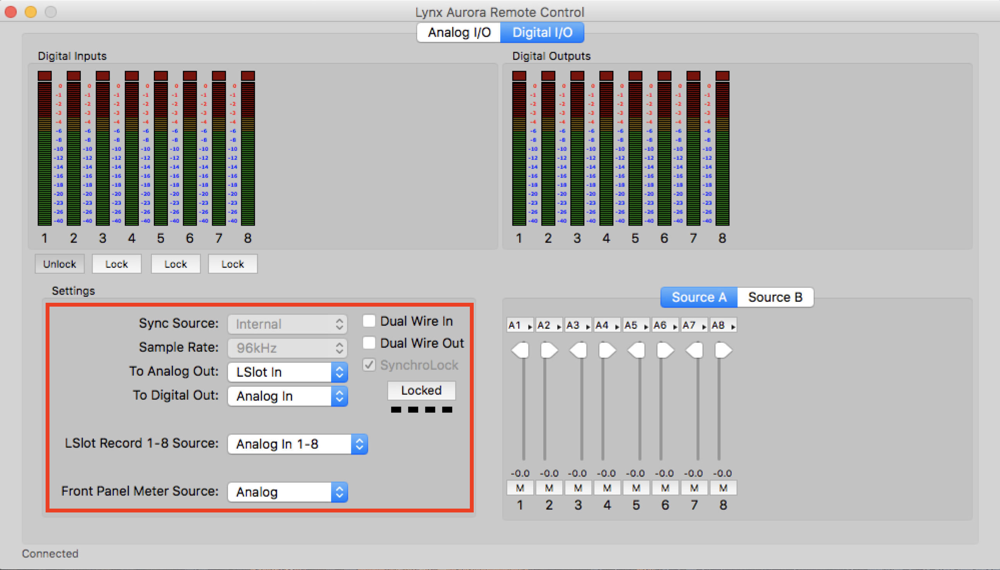

# Audio Reformatting Workstation   

# Table of Contents

# Workstation Overview

The CUNY TV Archive audio workstation is designed to carry out the preservation-reformatting of the audio signal carried on three obsolete media types: 1/4-inch open-reel tape, compact cassette, and DAT. The proccesses that the workstation performs include playback, analog to digital conversion, bitstream capture, file encoding, and the creation of metadata related to digital provenance.  

# Current Capabilities

The following is an overview of the workstation's technical capabilities:

### Open-reel tape, 1/4-inch

Current playback capabilities:  
  
>* Two-track and half-track formatting.  
>* 7 1/2 and 15 ips speeds.  
>* NAB equalization

Playback characteristics that may require additional equipment or outsourcing:  
  
>* Full-track, quarter-track and four-track formatting.   
>* 15/16, 1 7/8, 3 3/4, and 30 ips speed    
>* IEC, CCIR, Ampex and other non-NAB EQ pre-emphasis.  
>* Dolby A, Dolby B, Dolby S, Dolby SR and DBX noise reduction encoded

### Compact Cassette

Current playback capabilities:   

>* Quarter-track formatting.  
>* 1 7/8 ips speed.   
>* Dolby B and Dolby C noise reduction encoded.   
>* Type I, Type II (III) , Type IV equalization pre-emphasis

Playback characteristics that may require additional equipment or outsourcing:    

>* Half-track and four-track formatting.  
>* 3 3/4 ips speed.  
>* DBX noise reduction.  

### DAT

Current playback capabilities:     

TBD

Playback characteristics that may require additional equipment or outsourcing:      

TBD

### Analog to Digital Conversion

Current conversion capabilities:

>* 24 bit depth
>* 44.1, 48, 88.2, 96, 176.4, 192 kHz sample rate

### Capture and File encoding

Current capture and file encoding capabilities:   

>* 8, 16, 24, 32 (float) bit depth.  
>* 8, 16, 11.052, 16, 22.05, 32, 44.1, 48, 64, 88.2, 96, 176.4, 192 k samle rate
>* .aif, .aiff, .aifc, .ape, .bwf, .flac, .mp2, .mp3, .mov, .ogg, .wav format

### Monitoring. 

Current capabilities include selectable audio monitoring at three stages of the signal chain via a headphone amplifier:

>* AD/DA, Analog output. 
>* AD/DA, Digital output.
>* Playback deck, Analog output (via the headphone jack). 

# Workstation Diagram, Connections and Rack Elevation.  

The following diagrams illustrate the workstation equipment, signalflow, connections, and cables types.   
 
*Diagram and Connections.*  
.  

*Rack elevation, open-reel deck and headphone amp.*. 

# Power-up Order   

To ensure safe operation of the equipment and the proper connections between digital devices, power-up the equipment in the following order:

>1. Furman power conditioner.  
>1. Lynx Aurora 8 ad/da converter.  
>1. Playback deck(s), as needed.  
>2. Ampex Headpod 4 headphone amp.
>1. Mac.  

# Deck Settings and Quality Assurance Check

The following is a review of the major settings for each device in the workstation.  It covers two types of settings: 1) Default, which are permanent and do not require adjustment, and 2) Alligned, which are adjusted to accomodate the recording charecteristics of each object being reformatted.

This section also contains a quality assurance checklist to help assure that each device is operating properly.

### Open-reel deck

The followng settings, and the quality assurance checklist, are for the Studer a80RC, s/n 5175

Open-reel deck: default settings

>1. VU panel: Channel 1 REPROD switch in the IN position
>1. VU panel: Channel 2 REPROD switch in the IN position
>1. VU panel: monitor section REPRO/INPUT switch in the REPRO poition.  

Open-reel deck; settings alligned with the media

>1. VU panel: Channel 1 UNCAL switch in the ON position (in) and aligned with the source
>1. VU panel: Channel 2 UNCAL switch in the ON position (in) and aligned with the source
>1. VU panel: Monitor section (right side of the VU panel) CH1/CH1-2/CH2 switches aligned with the source. 
>1. Transport panel: SPEED switch (OFF-7 1/2-15) aligned with source. 
>1. Transport panel: Press 0 to to zero-out the counter before the start of playback for each side of a reel to align with the source.  
>2. Transport panel: Align Reproduce Head AZIMUTH SCREW with the source. 

*VU panel: Chanel 1 settings*. 
.   
 
 *VU panel: Monitor settings*.  
.  
 
 *Transport panel: Power and speed settings*
.  
 
 *Transport panel: Reproduce head azimuth setting*
.  
 

Quality assurance checklist for the Studer a80RC

>1. clean the erase, record, and reproduce heads, the capstan, the stationary posts, and roller guides with anhydrous isopropyl alcohol  
>1. clean the pinch roller with rubber cleaner  
>1. dust the transport with compressed air  
>1. degause the erase, record, and reproduce heads, the capstan, the stationary posts, and roller guides  
>1. align the deck and confirm its functionality with a reference tape

### Cassette deck

The followng settings, and the quality assurance checklist, are for the Tascam 122MKIII, s/n 8900215 983. 
  
*Front panel.*  
. 
  
  
*Rear panel.*  

Cassette deck default settings

>1. Rear Panel: INPUT switch in the BALANCED position
>1. Front Panel: MONITOR switch in the AUTO position
>1. Front Panel: MPX FILTER switch in the OFF position

Cassette deck settings to be alligned with the media

>1. Front Panel: PITCH CONTROL switch in the OFF position, re-set the switch to ON and align the deck with the source as needed  
>1. Front Panel:  RESET tape counter to zero-out the counter before the start of playback for each side of a cassette  
>1. Front Panel:  DOLBY NR switch is aligned with the source  
>1. Front Panel:  OUTPUT dial is aligned with calibration tones on the source.  When no reference tones are present on the source recording, load the reference tape and adjust the dial to align the output/VU meters with its tones
>2. 2. Front Panel: Align Record/Reproduce Head AZIMUTH with the source  

Cassette deck quality assurance checklist for the Tascam 122MKIII 

>1. clean the erase and record/reproduce head, and the capstan with anhydrous isopropyl alcohol  
>1. clean the pinch roller with rubber cleaner  
>1. dust the transport with compressed air  
>1. degause the the erase and record/reproduce head, and the capstan  
>1. align the deck and confirm its functionality with a reference tape
  
  
### DAT deck.  

Front panel.  
. 
  
  
Rear panel.  

### Analog to Digital Converter.  

The followng settings are for the Lynx Aurora 8, s/n 2714092190

Analog to Digital Converter default settings (found on the Lynx Aurora Remote Control application: Applications > Aurora)

Analog I/O
  
>1. TRIM: Set to +4DBU     
>2. TRIM ORIGIN: Set to REMOTE.  
>3. LOCAL TRIM: Set to +4DBU 
>4. POWER UP MODE: Set to STAND BY.  
>1. LSLOT CHANNEL MODE: Set to 8-CHANNEL.  
  
Lynx Aurora Remote Control Analog I/O Window.  

  . 

Digital I/O

>1. TO ANALOG OUT: Set to ANALOG IN.    
>1. TO DIGITAL OUT: Set to ANALOG INn.    
>1. LSLOT RECORD 1-8 SOURCE: Set to ANALOG IN 1-8  
  
Lynx Aurora Remote Control Digital I/O Window.
  . 

Analog to Digital Converter settings to be alligned with the media

Digital I/O.  

1. SYNC SOURCE*: Set to INTERNAL for analog sources; EXTERNAL for digital sources. 
1. SAMPLE RATE*: 96KHZ for analog sources; n/a for digital sources.  
1. Meter SOURCE: align for Analog or Digital sources.  

*These Digital I/O settings can be configured via the Mac utility Audio Devices (Utilities > Audio MIDI Setup), or via the Adobe Audition preferences (Adobe Audition CC > Preferences > Audio Hardware).

### Computer

The followng settings are for the Mac OS Sierra v10.12, s/n C02NW4V8FY14

* default settings and connections

1. System Preferences > Sound.     
Input: Set to LYNX AURORA USB.  
Output: Set to    FIX THIS.   
. 

ADD IMAGE

1. Audio devices (Utilities > Audio Devices).    

Built-in Output, Output: Set FORMAT to 2 CH 24-BIT Integer 96.0 KHZ.  [REVISE THIS]   
 

* settings to be alligned with the media

1. Utilities > Audio Devices.   
Lynx Aurora, Input:  Set FORMAT to 96,000 Hz for analog sources; align with te sample rate of of the source recording for digital souces. 
 

### Digital Audio Workstation.  

The followng settings are for the Adobe Audition CC, 2017.1.1 release

* default settings.  
Applications > Adobe Audition CC 2017.  

Audio Channel mapping.  
Audio Hardware.  
Spectral Displays.  

* settings to be alligned with the media
* quality assurance  

### Headphone amp.  

The followng settings are for the Aphex Headpod 4, s/n 1450

* default settings.  

1. Master: Set Master pot to the 12:00 O'CLOCK position

* settings to be alligned with the media

1. Input Select:  Set to ANALOG 1 to monitor the output of the  Lynx Aurora 8
1. Input Select:  Set to ANALOG 2 to monitor the headphone output of deck being used
1. Output 1:  Adjust OUTPUT 1 monitoring level as needed

# Physical Treatment of the Archive Original Recording

To assure optimal signal extraction from the archive original recording, and the protection and viability of the media and the playback deck, media is checked for conditions that may require treatment prior to transfer.   

Treatments are guided by the AIC Code of Ethics and Guidelines for Practice. [GET. THE LINK]

### Cassette: checklist of common conditions and treatments.   

1. Particulate matter (dust, dirt, etc.):   Surface clean with compressed air, vacuum, non-woven tissue or dry brushes.  
1. Biological contamination (mold, infestations, etc.) :  Stop and alert the Archivist if biological contamination is discovered.  This condition may require out-sourcing for remediation.   
1. Binder failure, Soft Binder Syndrome:  Stop and alert the the Archivist if Soft Binder Syndrome is discovered.  This condition may require out-sourcing for remediation.     
1. Binder failure, Sticky Shed Syndrome:  Follow the treatment procedure outlined in the Ampex Patent, #US6797072 B1, September 28, 2004.  
1. Binder failure, delamination and interlayer adhesion: Stop and alert the the Archivist if  delimitation or interlayer adhesion is discovered. This condition may require out-sourcing for remediation.     
1. Mechanical failure, container:  Replace damaged or non-standard cassette boxes.  
1. Mechanical failure, shell:  Replace damaged, missing or failing pressure pads, slip sheets, hubs, rollers, and shells.  
1. Mechanical failure, tape: Repair breaks, clean and replace failed splices; re-attach detatched leader to the hub.  
1. Print through:  Fast head-to-tail wind; fast tail-to-head rewind.  
1. Tape pack abnormalities:  Manual wind or play wind as needed; allow short-term storage in an archival wind to treat edge damage, twists, folds or other tape deformation caused by poor tape pack and storage.  
1. Record disable :  Remove record-enable tabs from the shell.  

### Open-reel: checklist of common conditions and treatments.

1. Particulate matter (dust, dirt, etc.):   Surface clean with compressed air, vacuum, non-woven tissue or dry brushes.
1. Biological contamination (mold, infestations, etc.):  Stop and alert the Archivist if biological contamination is discovered.  This condition may require out-sourcing for remediation.   
1. Binder failure, Soft Binder Syndrome:  Stop and alert the the Archivist if Soft Binder Syndrome is discovered.  This condition may require out-sourcing for remediation.     
1. Binder failure, Sticky Shed Syndrome:  Follow the treatment procedure outlined in the Ampex Patent, #US6797072 B1, September 28, 2004.  
1. Binder failure, delamination and interlayer adhesion: Stop and alert the the Archivist if  delimitation or interlayer adhesion is discovered. This condition may require out-sourcing for remediation.     
1. Mechanical failure, container:  Replace damaged or non-standard open-reel boxes.   
1. Mechanical failure, reel:  Replace damaged or non-standard reels. 
1. Mechanical failure, tape:  Repair breaks; clean and replace failed splices (dry, oozing, etc.); replace failed or missing leader.
1. Dimensional distortion:  Manual wind, play wind, reverse wind (B-wind) and/or short-term storage in an archival wind to treat edge damage, twists, folds or other tape deformation caused by poor tape pack and shrinkage.   
1. Print-through: Fast head-to-tail wind, fast tail-to-head wind.  
2. Vinegar Syndrome:  Stop and alert the Archivist if Vinegar Syndrome is discovered.  This condition may require out-sourcing for remediation.   

### DAT.  

TBD

# Audio Preservation Master Productions and File Specifications

The Audio Preservation Master File is the highest-level digital derivative of an archive original recording.  It is produced to represent a complete and unmodified copy of the archive original recording's signal, and so is produced free of signal processing, editing, equalization, level adjustment, and sonic restoration.

### The Audio Preservation Master File production will: 

* represent the complete recorded content of the archive original recording, including the principal program content, any and all unidentified and undocumented content, calibration tones, and any and all pre and post-program ambient sound.
* represent the complete dynamic and frequency range of the archive original recording
* be produced de-emphasising any noise reduction system inherant in the signal (Dolby A, B, etc.).   
* be produced de-emphasising any equalization system inherant in the signal (Type I, II, etc.). 
* be produced to comply with the technical recommendations, practices and strategies outlined in the International Association of Audiovisual Archives’, Guidelines on the Production and Preservation of Digital Audio Objects, IASA-TC 04, 2nd edition

### Audio Preservation Master Files will be produced using the following file specifications:

For the reformatting of **analog** archive original recordings.   
 
* BWF file.  
* 96k sample rate.  
* 24 bit depth.  
* One or two-channel file as appropriate [yes?].  

For the reformatting of **digital** archive original recordings.  

* BWF file [YES?].  
* Sample rate equal to the archive original recording’s sample rate[yes?]   
* Bit depth equal to the archive original recording’s bit depth [yes?]  
* One or two-channel file as appropriate [yes?]

# Audio [Presentation] Master Production and File Specifications. (FIX ALL OF THIS SECTION)

The Audio [Presentation] Master file is a digital reconstruction of an original asset.  It is produced from one or more Audio Preservation Master files, and is created to reconstruct an asset, optimize program continuity, provide access to the asset, and to correct excessive sonic distortion in the original signal.  The Audio [Presentation] Master file is not necessarily a full restoration. [FIX THIS}

The Audio [Presentation] Master will contain:

* Edit of head, tail, or internal sections of the file, to eliminate portions of the Audio Preservation Master file with no program content [fix this]. 
* Level/Loudness adjustment to offset any channel discrepancies, and to normalize the overall amplitude to -2dBFS.

The Audio [Presentation] Master may contain:

* File joins, to reconstruct a program when an asset has two or more Audio Preservation Master files
*  Sum to mono [only for lateral disc that were reformatted in the “stereo” mode]
* Channel balance, as needed
* De-click/de-crackle processing, only as needed
* Broadband Noise reduction processing, only for extreme cases of broadband distortion
* EQ processing, only to eliminate extreme grounding distortion, rumble or other signal anomalies that impede listenability [is that a word?]
* Speed correction as needed
* Phase/polarity correction as needed

Audio [Access] Master files will be produced using the following file specs:

For reformatted analog archive original recordings:

* WAV file format
* 48k sample rate
* 24 bit depth
* One or two-channel file as appropriate

For reformatted digital archive original recordings: 

* WAV file format
* Sample rate equal to the archive original recording’s sample rate [yes?]
* Bit depth equal to the archive original recording’s bit depth [yes?]
* One or two-channel file as appropriate [yes?]

Audio [Presentation] Master Files will contain the [following metadata] embedded in the [?]

# File-naming conventions.  

### Audio Preservation Master Files will be named using the following convention:

* Format identifier + Face identifier + Region identifier (optional as needed) + file extension

	Example:	HBG00006_01.wav

### Audio Presentation Master files will be named using the following convention:

•	Asset identifier + file extension.  Example:		BSW19390403.wav

# Metadata

#3# Audio Preservation Master File (digi-prov?) Metadata

The following metadata is created for each Audio Preservation Master file to document technical aspects of the Archive Original Recording and the reformatting processes.

### Archive Original Recording Description.  

* object stock manufacturer  
* object stock number  
* object speed 
* object track configuration  
* object soundfield   
* object condition summary
* object treatment summary 

### Playback Deck and Deck Settings Description.  

* deck model and sn 
* deck speed setting 
* deck head setting 
* deck eq setting  
* deck noise reduction setting  
* deck operating level setting

### Converter and Converter Settings Description.  

* adda converter model and sn  
* adda converter clock setting  
* adda converter sr setting  
* adda converter level calibration setting

## Reformatting Workflows

### Barcode

### Photo documentation. 

### Media treatment checklist

### Signalflow and equipment connections

### Equipment settings and alignment

### File production specifications 

### Metadata

### Region marker for the [Presentation] master.  
label marker, "presentation"

