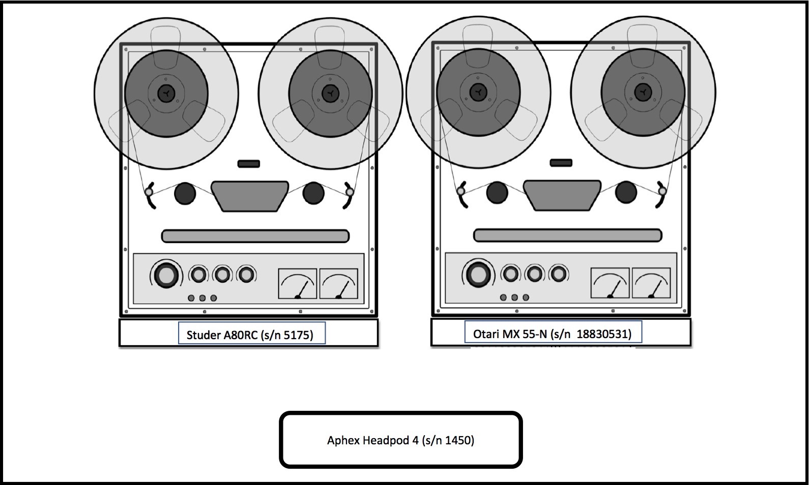

# Workstation Overview

The CUNY TV Archive audio workstation is designed to carry out the preservation-reformatting of the audio signal carried on three obsolete media types: 1/4-inch open-reel tape, compact cassette, and DAT. The proccesses that the workstation performs include playback, analog to digital conversion, bitstream capture, file encoding, and the creation of metadata related to digital provenance.  

# Current Capabilities

The following is an overview of the workstation's technical capabilities:

### Open-reel tape, 1/4-inch

Current playback capabilities:  
  
  * Two-track and half-track formatting.  
  * 7 1/2 and 15 ips speeds.  
  * NAB equalization

Playback characteristics that may require additional equipment or outsourcing:  
  
  * Full-track, quarter-track and four-track formatting.   
  * 15/16, 1 7/8, 3 3/4, and 30 ips speed    
  * IEC, CCIR, Ampex and other non-NAB EQ pre-emphasis.  
  * Dolby A, Dolby B, Dolby S, Dolby SR and DBX noise reduction encoded

### Compact Cassette

Current playback capabilities:   

  * Quarter-track formatting.  
  * 1 7/8 ips speed.   
  * Dolby B and Dolby C noise reduction encoded.   
  * Type I, Type II (III) , Type IV equalization pre-emphasis

Playback characteristics that may require additional equipment or outsourcing:    

  * Half-track and four-track formatting.  
  * 3 3/4 ips speed.  
  * DBX noise reduction.  

### DAT

Current playback capabilities:     

TBD

Playback characteristics that may require additional equipment or outsourcing:      

TBD

### Analog to Digital Conversion

Current conversion capabilities:

  * Bit depth: 24
  * Sample rate: 44.1, 48, 88.2, 96, 176.4, 192 kHz

### Capture and File encoding

Current capture and file encoding capabilities:   

  * Bit depth: 8, 16, 24, 32 (float)  
  * Sample rate: 8, 16, 11.052, 16, 22.05, 32, 44.1, 48, 64, 88.2, 96, 176.4, 192 kHz
  * File format:  .aif, .aiff, .aifc, .ape, .bwf, .flac, .mp2, .mp3, .mov, .ogg, .wav

### Monitoring. 

Current capabilities include selectable audio monitoring at three stages of the signal chain via a headphone amplifier:

  * AD/DA, Analog output. 
  * Playback deck, Analog output (via the headphone jack).  
  * [AD/DA, Digital output AES to SPDIF Cable needed for this]

# Workstation Diagram, Connections and Rack Elevation.  

The following diagrams illustrate the workstation equipment, signalflow, connections, and cables types.   
 
*Diagram 1, Signalflow and connections*  
.  

*Diagram 2, Rack elevation*. 
. 

*Diagram 3, Open-reel decks and headphone amp.*. 

