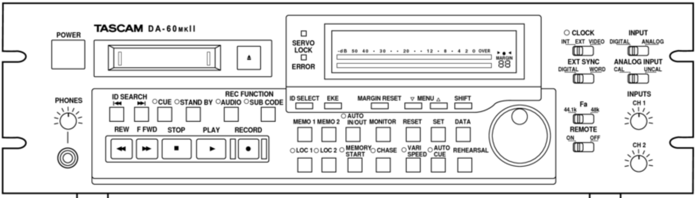
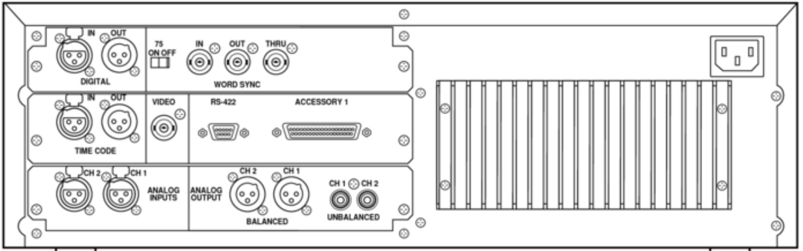

# Deck Settings and Quality Assurance Check

The following is a review of the major settings for each device in the workstation.  It covers two types of settings: 1) Default, which are permanent and do not require adjustment, and 2) Alligned, which are adjusted to accomodate the recording charecteristics of each object being reformatted.

This section also contains a quality assurance checklist to help assure that each device is operating properly.

### Open-reel deck

The followng settings, and the quality assurance checklist, are for the Studer a80RC, s/n 5175

#### Open-reel deck: default settings

>1. VU panel: Channel 1 REPROD switch in the IN position
>1. VU panel: Channel 2 REPROD switch in the IN position
>1. VU panel: monitor section REPRO/INPUT switch in the REPRO poition.  

#### Open-reel deck; settings alligned with the media

>1. VU panel: Channel 1 UNCAL switch in the ON position (in) and aligned with the source
>1. VU panel: Channel 2 UNCAL switch in the ON position (in) and aligned with the source
>1. VU panel: Monitor section (right side of the VU panel) CH1/CH1-2/CH2 switches aligned with the source. 
>1. Transport panel: SPEED switch (OFF-7 1/2-15) aligned with source. 
>1. Transport panel: Press 0 to to zero-out the counter before the start of playback for each side of a reel to align with the source.  
>2. Transport panel: Align Reproduce Head AZIMUTH SCREW with the source. 

*VU panel: Chanel 1 settings*. 
.   
 
 *VU panel: Monitor settings*.  
.  
 
 *Transport panel: Power and speed settings*
.  
 
 *Transport panel: Reproduce head azimuth setting*
.  
 

#### Quality assurance checklist for the Studer a80RC

>1. clean the erase, record, and reproduce heads, the capstan, the stationary posts, and roller guides with anhydrous isopropyl alcohol  
>1. clean the pinch roller with rubber cleaner  
>1. dust the transport with compressed air  
>1. degause the erase, record, and reproduce heads, the capstan, the stationary posts, and roller guides  
>1. align the deck and confirm its functionality with a reference tape

### Cassette deck

The followng settings, and the quality assurance checklist, are for the Tascam 122MKIII, s/n 8900215 983. 
  
  
#### Cassette deck: default settings

>1. Rear Panel: INPUT switch in the BALANCED position
>1. Front Panel: MONITOR switch in the AUTO position
>1. Front Panel: MPX FILTER switch in the OFF position

#### Cassette deck: settings to be alligned with the media

>1. Front Panel: PITCH CONTROL switch in the OFF position, re-set the switch to ON and align the deck with the source as needed  
>1. Front Panel:  RESET tape counter to zero-out the counter before the start of playback for each side of a cassette  
>1. Front Panel:  DOLBY NR switch is aligned with the source  
>1. Front Panel:  OUTPUT dial is aligned with calibration tones on the source.  When no reference tones are present on the source recording, load the reference tape and adjust the dial to align the output/VU meters with its tones
>2. 2. Front Panel: Align Record/Reproduce Head AZIMUTH with the source  
  
  
*Front panel, left side.*  
.   

*Front panel, right side.*  
. 
  
*Rear panel.*  
. 

#### Cassette deck quality assurance checklist for the Tascam 122MKIII 

>1. clean the erase and record/reproduce head, and the capstan with anhydrous isopropyl alcohol  
>1. clean the pinch roller with rubber cleaner  
>1. dust the transport with compressed air  
>1. degause the the erase and record/reproduce head, and the capstan  
>1. align the deck and confirm its functionality with a reference tape
  
  
### DAT deck.  

*Front panel.*  
. 
  
  
*Rear panel.*  
. 
### Analog to Digital Converter.  

The followng settings are for the Lynx Aurora 8, s/n 2714092190

Analog to Digital Converter settings (found on the Lynx Aurora Remote Control application: Applications > Aurora)

#### Converter: default settings. 

Analog I/O
  
>1. TRIM: Set to +4DBU     
>2. TRIM ORIGIN: Set to REMOTE.  
>3. LOCAL TRIM: Set to +4DBU 
>4. POWER UP MODE: Set to STAND BY.  
>1. LSLOT CHANNEL MODE: Set to 8-CHANNEL.  
  
Digital I/O

>1. TO ANALOG OUT: Set to ANALOG IN.    
>1. TO DIGITAL OUT: Set to ANALOG INn.    
>1. LSLOT RECORD 1-8 SOURCE: Set to ANALOG IN 1-8  
  
#### Converter: settings to be alligned with the media

Digital I/O.  

>1. SYNC SOURCE*: Set to INTERNAL for analog sources; EXTERNAL for digital sources. 
>1. SAMPLE RATE*: 96KHZ for analog sources; n/a for digital sources.  
>1. Meter SOURCE: align for Analog or Digital sources.  

*These Digital I/O settings can be configured and aligned via the Mac utility Audio Devices (Utilities > Audio MIDI Setup), or via the Adobe Audition preferences (Adobe Audition CC > Preferences > Audio Hardware).

*Analog I/O Window.*  

.  

*Digital I/O Window.*  

.  

### Computer

The followng settings are for the Mac OS Sierra v10.12, s/n C02NW4V8FY14

* default settings and connections

1. System Preferences > Sound.     
Input: Set to LYNX AURORA USB.  
Output: Set to    FIX THIS.   

. 

ADD IMAGE

1. Audio devices (Utilities > Audio Devices).    

Built-in Output, Output: Set FORMAT to 2 CH 24-BIT Integer 96.0 KHZ.  [REVISE THIS]   
 

* settings to be alligned with the media

1. Utilities > Audio Devices.   
Lynx Aurora, Input:  Set FORMAT to 96,000 Hz for analog sources; align with te sample rate of of the source recording for digital souces. 
 

### Digital Audio Workstation.  

The followng settings are for the Adobe Audition CC, 2017.1.1 release

* default settings.  
Applications > Adobe Audition CC 2017.  

Audio Channel mapping.  
Audio Hardware.  
Spectral Displays.  

* settings to be alligned with the media
* quality assurance  

### Headphone amp.  

The followng settings are for the Aphex Headpod 4, s/n 1450. 

* default settings.  

1. Master: Set Master pot to the 12:00 O'CLOCK position

* settings to be alligned with the media

1. Input Select:  Set to ANALOG 1 to monitor the output of the  Lynx Aurora 8
1. Input Select:  Set to ANALOG 2 to monitor the headphone output of deck being used
1. Output 1:  Adjust OUTPUT 1 monitoring level as needed
